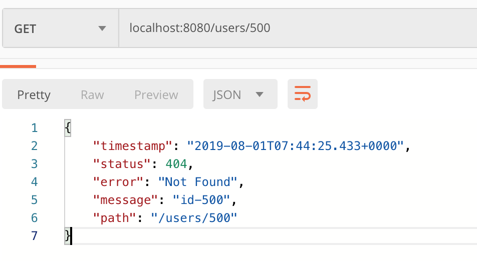

# Restful Web Services

Repository for ReST web Services.

Enable logging level for spring framework. In the **application.properties** create the below entry:
`logging.level.org.springframework = debug`

## What is Dispatcher Servlet?

## Who is configuring the Dispatcher Servlet?

The below information is from the logs:

`o.s.b.w.s.ServletContextInitializerBeans : Mapping servlets: dispatcherServlet urls=[/]`

## Modifcations
### How do we return to the user if an 'id' is not found?

1. Create 'UserNotFoundException'

The above message is generated by default error handling of Spring boot and Spring MVC framework. It's important to have
consistent error message for the services ( Standard Exception structure ).